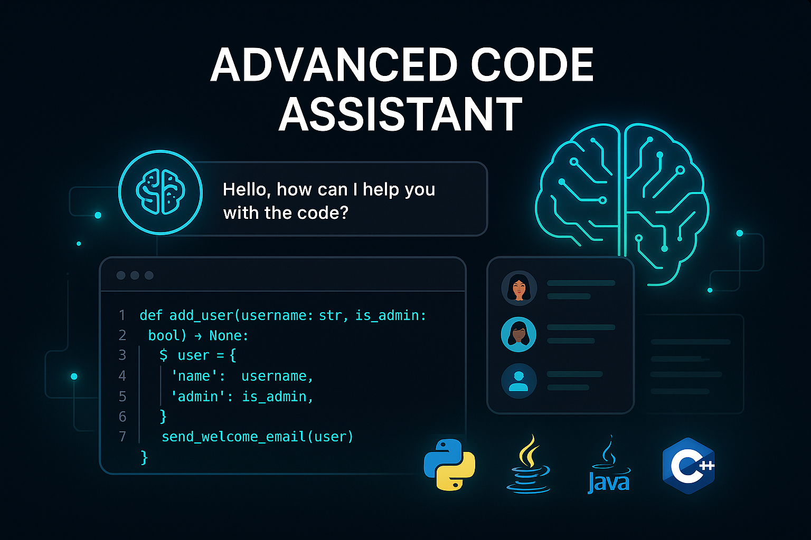
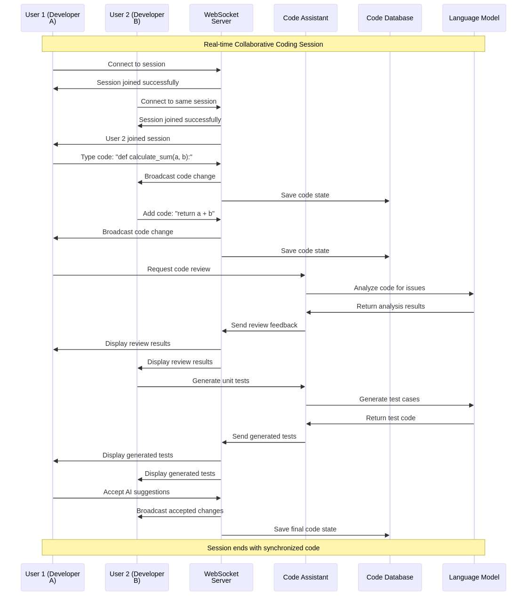
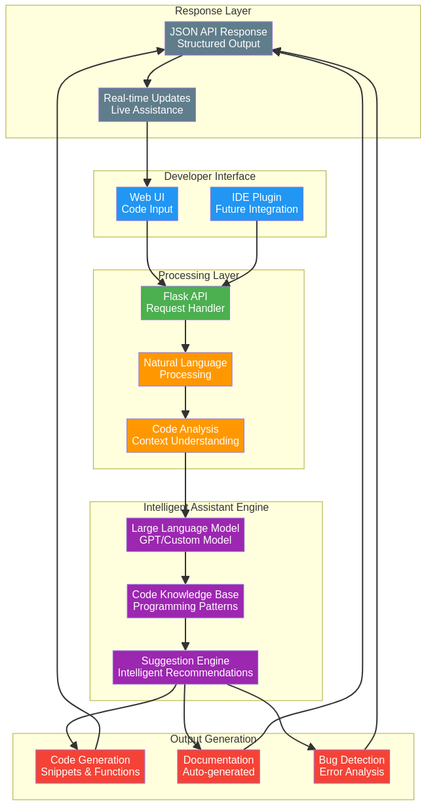
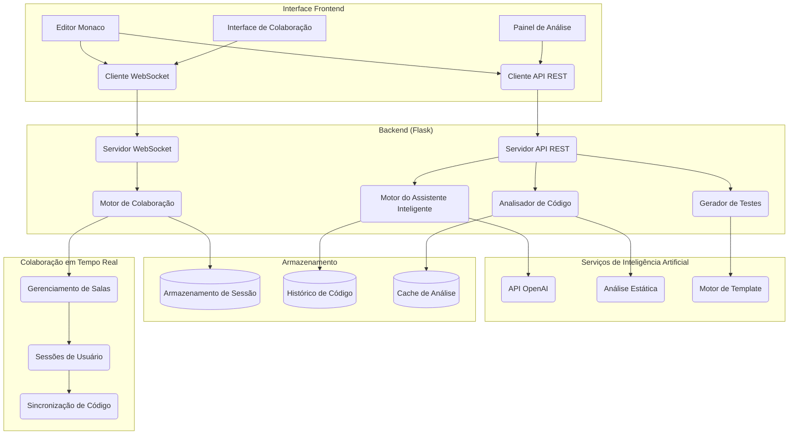

# Advanced Code Assistant

**Autor:** Gabriel Demetrios Lafis


[**Ver Código no GitHub**](https://github.com/galafis/AI-Code-Assistant/) | [**Documentação Completa**](https://github.com/galafis/AI-Code-Assistant/blob/main/README.md/)









## 📁 Estrutura do Projeto

```
.
├── src/                 # Código fonte principal
│   ├── api/             # Endpoints da API
│   ├── models/          # Modelos de dados
│   ├── services/        # Lógica de negócio
│   └── utils/           # Utilitários
├── tests/               # Testes unitários e integração
├── docs/                # Documentação
├── frontend/            # Interface do usuário
│   ├── components/      # Componentes React
│   ├── assets/          # Imagens e estilos
│   └── public/          # Arquivos públicos
├── config/              # Configurações
└── requirements.txt     # Dependências Python
```


---

## 🇧🇷 Assistente de Código Avançado

### Visão Geral

Este projeto é um assistente de código de nível profissional, construído com Python, Flask e o editor Monaco, que oferece uma experiência de desenvolvimento colaborativa e inteligente em tempo real. A aplicação integra um modelo de linguagem de grande escala (LLM) para fornecer funcionalidades avançadas de assistência de código, como geração de testes, revisão de código e análise de segurança.

Com suporte para mais de 15 linguagens de programação, análise de código em tempo real e colaboração simultânea via WebSockets, este projeto é uma demonstração poderosa de como a assistência inteligente pode ser integrada em ferramentas de desenvolvimento para aumentar a produtividade e a qualidade do código.

### Funcionalidades Principais

- **Editor de Código Monaco Integrado**: A aplicação utiliza o editor Monaco, o mesmo que alimenta o VS Code, para oferecer uma experiência de edição de código rica e familiar, com suporte a realce de sintaxe para mais de 15 linguagens.

- **Análise de Código em Tempo Real**: O código é analisado em tempo real para fornecer feedback instantâneo, identificar erros e sugerir melhorias. A análise de complexidade ciclomática ajuda a manter o código simples e manutenível.

- **Colaboração Simultânea**: Múltiplos usuários podem editar o mesmo arquivo de código simultaneamente, com as alterações sendo sincronizadas em tempo real para todos os participantes através de WebSockets. A presença de cursores de outros usuários é exibida no editor.

- **Assistente de Código Inteligente com LLM**: O assistente de código inteligente, alimentado por um modelo de linguagem de grande escala, oferece várias funcionalidades inteligentes: 
    - **Geração de Testes Unitários**: Gera automaticamente testes unitários para o código selecionado.
    - **Revisão de Código**: Analisa o código em busca de bugs, vulnerabilidades e problemas de estilo, fornecendo sugestões de melhoria.
    - **Análise de Segurança**: Realiza uma análise de segurança no código para identificar potenciais vulnerabilidades.
    - **Otimização de Código**: Sugere otimizações de performance para o código.

- **Suporte a Múltiplas Linguagens**: O assistente de código inteligente e o editor de código suportam uma ampla gama de linguagens, incluindo Python, JavaScript, Java, C++, Go, Rust, e muitas outras.

- **Interface de Usuário Moderna**: A interface, construída com HTML, CSS e JavaScript, é limpa, intuitiva e focada na experiência do desenvolvedor.

### Arquitetura do Sistema

O diagrama a seguir ilustra a arquitetura do Assistente de Código Avançado com Assistência Inteligente:  



### Como Executar o Projeto

1.  **Clone o repositório:**

    ```bash
    git clone https://github.com/galafis/AI-Code-Assistant.git
    cd AI-Code-Assistant
    ```

2.  **Crie e ative um ambiente virtual:**

    ```bash
    python3 -m venv venv
    source venv/bin/activate
    ```

3.  **Instale as dependências:**

    ```bash
    pip install -r requirements.txt
    ```

4.  **Configure as variáveis de ambiente:**

    Crie um arquivo `.env` na raiz do projeto e adicione sua chave de API do OpenAI:

    ```
    OPENAI_API_KEY=sua-chave-de-api-do-openai
    ```

5.  **Execute a aplicação:**

    ```bash
    python advanced_code_assistant.py
    ```

6.  **Acesse a aplicação:**

    Abra seu navegador e acesse `http://127.0.0.1:5000`.

---

## 🇺🇸 Advanced Code Assistant

### Overview

This project is a professional-grade code assistant, built with Python, Flask, and the Monaco editor, that offers a collaborative and intelligent real-time development experience. The application integrates a large language model (LLM) to provide advanced code assistance features, such as test generation, code review, and security analysis.

With support for over 15 programming languages, real-time code analysis, and simultaneous collaboration via WebSockets, this project is a powerful demonstration of how intelligent assistance can be integrated into development tools to increase productivity and code quality.

### Key Features

- **Integrated Monaco Code Editor**: The application uses the Monaco editor, the same one that powers VS Code, to offer a rich and familiar code editing experience, with syntax highlighting support for over 15 languages.

- **Real-time Code Analysis**: The code is analyzed in real-time to provide instant feedback, identify errors, and suggest improvements. Cyclomatic complexity analysis helps to keep the code simple and maintainable.

- **Simultaneous Collaboration**: Multiple users can edit the same code file simultaneously, with changes being synchronized in real-time for all participants via WebSockets. The presence of other users' cursors is displayed in the editor.

- **Intelligent Code Assistant with LLM**: The intelligent code assistant, powered by a large language model, offers several intelligent features:
    - **Unit Test Generation**: Automatically generates unit tests for the selected code.
    - **Code Review**: Analyzes the code for bugs, vulnerabilities, and style issues, providing suggestions for improvement.
    - **Security Analysis**: Performs a security analysis on the code to identify potential vulnerabilities.
    - **Code Optimization**: Suggests performance optimizations for the code.

- **Multi-language Support**: The intelligent code assistant and code editor support a wide range of languages, including Python, JavaScript, Java, C++, Go, Rust, and many others.

- **Modern User Interface**: The interface, built with HTML, CSS, and JavaScript, is clean, intuitive, and focused on the developer experience.

### System Architecture

The following diagram illustrates the architecture of the Advanced Code Assistant with Intelligent Assistance: 

```mermaid
graph TD
    subgraph "Frontend"
        A[Monaco Editor] --> B(WebSocket Client)
        A --> C(API REST Client)
    end

    subgraph "Backend (Flask)"
        B --> D(WebSocket Server)
        C --> E(API REST Server)
        D --> F(Collaboration Engine)
        E --> G(Intelligent Assistant Engine)
    end

    subgraph "Artificial Intelligence"
        G --> H[Large Language Model (LLM)]
    end

    F --> B
```

### How to Run the Project

1.  **Clone the repository:**

    ```bash
    git clone https://github.com/galafis/AI-Code-Assistant.git
    cd AI-Code-Assistant
    ```

2.  **Create and activate a virtual environment:**

    ```bash
    python3 -m venv venv
    source venv/bin/activate
    ```

3.  **Install the dependencies:**

    ```bash
    pip install -r requirements.txt
    ```

4.  **Configure environment variables:**

    Create a `.env` file in the project root and add your OpenAI API key:

    ```
    OPENAI_API_KEY=your-openai-api-key
    ```

5.  **Run the application:**

    ```bash
    python advanced_code_assistant.py
    ```

6.  **Access the application:**

    Open your browser and go to `http://127.0.0.1:5000`.


## 🌐 GitHub Pages

Este projeto está disponível publicamente através do GitHub Pages. Você pode acessá-lo em: [https://galafis.github.io/AI-Code-Assistant/](https://galafis.github.io/AI-Code-Assistant/)


