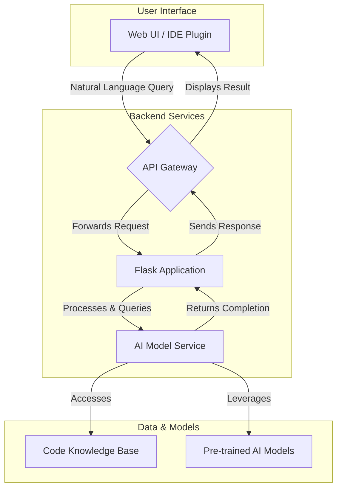
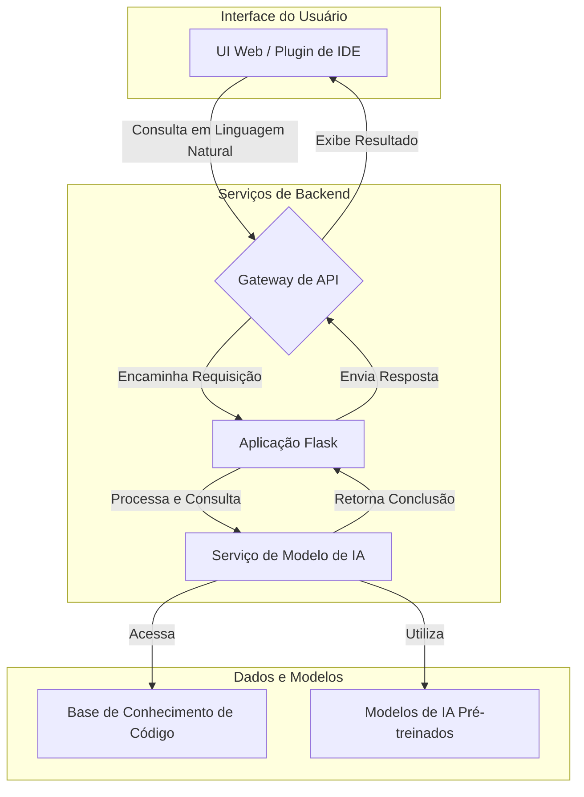

# AI Code Assistant

**Author**: Gabriel Demetrios Lafis

---

## 🇬🇧 English

### 📋 Description

AI Code Assistant is a conceptual project designed to explore the integration of Artificial Intelligence with the software development workflow. This repository serves as a foundation for building a smart assistant that can understand code, provide intelligent suggestions, automate repetitive tasks, and generate code snippets based on natural language descriptions.

The current implementation provides a basic web interface built with Flask and a modern JavaScript frontend, which acts as a user-facing platform for future AI-powered features. The vision is to connect this interface to a powerful backend model (such as OpenAI's GPT series or a custom-trained model) to deliver a seamless and intelligent coding experience.

### 🏛️ Vision & Architecture

The long-term vision is a sophisticated system where a developer can interact with the AI assistant through a web UI or directly in their IDE. The AI would analyze the context of the code and provide real-time assistance.



### ✨ Features (Current & Planned)

- **(Current) Web Interface**: A responsive and modern UI built with HTML5, CSS3, and JavaScript.
- **(Current) Flask Backend**: A lightweight Python backend to serve the frontend and handle API requests.
- **(Planned) Natural Language to Code**: Generate code from plain English descriptions.
- **(Planned) Code Completion & Suggestion**: Provide context-aware code completions.
- **(Planned) Bug Detection & Fixing**: Automatically identify and suggest fixes for common errors.
- **(Planned) Documentation Generation**: Create documentation for functions and classes automatically.

### 🛠️ Tech Stack

- **Backend**: Python, Flask
- **Frontend**: HTML5, CSS3, JavaScript (ES6+)
- **AI/ML (Planned)**: OpenAI API, TensorFlow/PyTorch, Scikit-learn

### 🚀 Getting Started

#### Prerequisites

- **Python 3.8+**
- **Pip** package manager

#### Installation & Configuration

1.  **Clone the Repository**:
    ```bash
    git clone https://github.com/galafis/AI-Code-Assistant.git
    cd AI-Code-Assistant
    ```

2.  **Set up a Virtual Environment**:
    ```bash
    python -m venv venv
    source venv/bin/activate  # On Windows use: venv\Scripts\activate
    ```

3.  **Install Dependencies**:
    ```bash
    pip install -r requirements.txt
    ```

4.  **Run the Application**:
    ```bash
    python app.py
    ```
    The web interface will be available at `http://127.0.0.1:5000`.

### 💻 Usage

Once the application is running, open your web browser and navigate to `http://127.0.0.1:5000`. The current version displays the frontend interface. The next steps in development will involve connecting the input fields to the backend API and integrating an AI model to process the requests.

### 📄 License

This project is licensed under the MIT License. See the [LICENSE](LICENSE) file for details.

---

## 🇧🇷 Português

### 📋 Descrição

O AI Code Assistant é um projeto conceitual projetado para explorar a integração da Inteligência Artificial com o fluxo de trabalho de desenvolvimento de software. Este repositório serve como base para a construção de um assistente inteligente que pode entender código, fornecer sugestões inteligentes, automatizar tarefas repetitivas e gerar trechos de código com base em descrições em linguagem natural.

A implementação atual fornece uma interface web básica construída com Flask e um frontend moderno em JavaScript, que atua como uma plataforma voltada para o usuário para futuras funcionalidades alimentadas por IA. A visão é conectar esta interface a um poderoso modelo de backend (como a série GPT da OpenAI ou um modelo treinado sob medida) para oferecer uma experiência de codificação perfeita e inteligente.

### 🏛️ Visão e Arquitetura

A visão de longo prazo é um sistema sofisticado onde um desenvolvedor pode interagir com o assistente de IA através de uma interface de usuário da web ou diretamente em seu IDE. A IA analisaria o contexto do código e forneceria assistência em tempo real.



### ✨ Funcionalidades (Atuais e Planejadas)

- **(Atual) Interface Web**: Uma UI responsiva e moderna construída com HTML5, CSS3 e JavaScript.
- **(Atual) Backend Flask**: Um backend leve em Python para servir o frontend e lidar com requisições de API.
- **(Planejado) Linguagem Natural para Código**: Gerar código a partir de descrições em português claro.
- **(Planejado) Conclusão e Sugestão de Código**: Fornecer conclusões de código sensíveis ao contexto.
- **(Planejado) Detecção e Correção de Bugs**: Identificar e sugerir correções para erros comuns automaticamente.
- **(Planejado) Geração de Documentação**: Criar documentação para funções e classes automaticamente.

### 🛠️ Tecnologias Utilizadas

- **Backend**: Python, Flask
- **Frontend**: HTML5, CSS3, JavaScript (ES6+)
- **IA/ML (Planejado)**: API da OpenAI, TensorFlow/PyTorch, Scikit-learn

### 🚀 Como Começar

#### Pré-requisitos

- **Python 3.8+**
- Gerenciador de pacotes **Pip**

#### Instalação e Configuração

1.  **Clonar o Repositório**:
    ```bash
    git clone https://github.com/galafis/AI-Code-Assistant.git
    cd AI-Code-Assistant
    ```

2.  **Configurar um Ambiente Virtual**:
    ```bash
    python -m venv venv
    source venv/bin/activate  # No Windows, use: venv\Scripts\activate
    ```

3.  **Instalar Dependências**:
    ```bash
    pip install -r requirements.txt
    ```

4.  **Executar a Aplicação**:
    ```bash
    python app.py
    ```
    A interface web estará disponível em `http://127.0.0.1:5000`.

### 💻 Uso

Com a aplicação em execução, abra seu navegador e navegue para `http://127.0.0.1:5000`. A versão atual exibe a interface do frontend. Os próximos passos no desenvolvimento envolverão a conexão dos campos de entrada com a API de backend e a integração de um modelo de IA para processar as requisições.

### 📄 Licença

Este projeto está licenciado sob a Licença MIT. Veja o arquivo [LICENSE](LICENSE) para mais detalhes.

